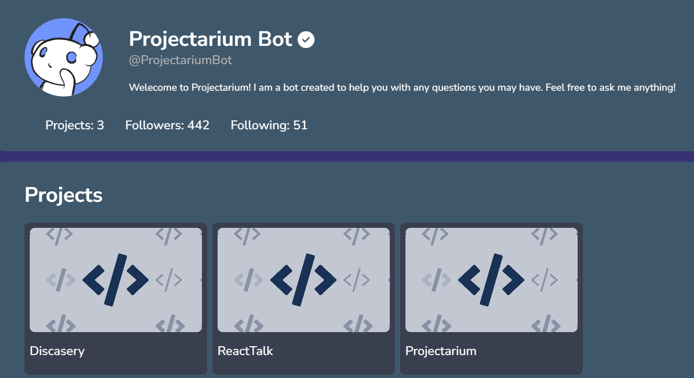

# Projectarium



Projectarium is a platform where users can share their projects, discover other users' creations, and connect within a community. The site enables users to showcase their projects, like and comment on others' work, and engage in private messaging with fellow creators. Users can also edit their profiles, search for projects, and even sponsor their work to have it featured on the homepage.

## Features
- **Project Sharing**: Users can upload and share their projects with the community.
- **Likes and Comments**: Engage with projects by liking and commenting to provide feedback and appreciation.
- **Private Messaging**: Connect directly with other users through private messages.
- **Account Management**: Update profile information, including changing the account password.
- **Project Search**: Find specific projects using the search feature.
- **Sponsorship**: Sponsored projects are highlighted on Projectarium’s front page for increased visibility.

## Technologies Used
- **Frontend**: ReactJS & Redux
- **Backend**: Express
- **Database**: MongoDB

## Getting started
### Prerequisites
- **Node:js**: Make sure Node.js is installed, you can install it [here](https://nodejs.org/en/download/package-manager)!
- **MongoDB**: Make sure you have a MongoDB URI. If you do, add a ``.env`` file in the [Backend folder](./src/Backend/) and in that file, add the following line:
```bash
# in .env
MONGO_URI=mongodb+srv://<username>:<password>@cluster0.qk6mh.mongodb.net/?retryWrites=true&w=majority&appName=Cluster0
# <username> and <password> are your login details for the database.
```

### Installation

1. Clone the git repository:
```bash
git clone https://github.com/LordBugsy/Projectarium.git
cd Projectarium/projectarium
```

2. **Install Dependencies**: In the Backend folder, follow the instructions in the ``Installation`` [text file](./src/Backend/Installations.txt) for setting up any required packages or dependencies.

3. **Start the project**:
```bash
npm start
```
This will run both the Frontend and Backend servers

## Licence
This project is provided under a custom license. Users are allowed to view and learn from the code, but they may not redistribute, modify, or use it for commercial purposes. See the [LICENCE](./LICENCE.txt) file for details.

## Miscellaneous
This project took me 2 entire months to complete! If you find any bugs, please let me know so I can fix them as soon as possible!
Also, make sure that EVERY dynamic route (such as ``/api/:userID`` or ``*``) are at the end of your route file. If they aren't, your server might throw an error because dynamic routes act like a "Catch-All" route.

Anyway, I hope you will have fun with **Projectarium**!

Copyright 2024 LordBugsy. All Rights Reserved.
